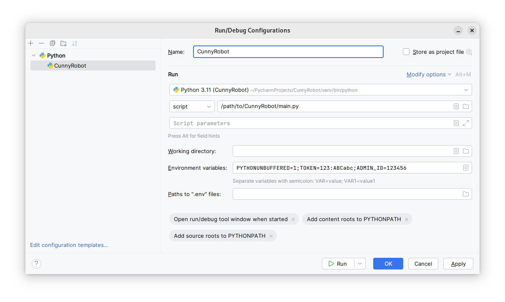
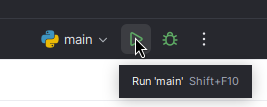

# CunnyRobot

Телеграм-бот для модерации чатов.

## Использование

- Добавьте [CunnyRobot](https://t.me/CunnyRobot/) в чат
- Настройте права админстратора для бота через интерфейс Telegram
- Настройте бота через команду `/configure`

## Функциональность
- Блокировка пользователей
- Мьют пользователей
- Предупреждения
- Автоматическая блокировка спамеров из Combot Anti-Spam System
- Режим комментариев (Вход в чат отключается, все сообщения кроме комментариев удаляются)
- Трибуналы (мьют пользователей через голосование)

## Поднятие своего инстанса и разработка

Следующие шаги необходимы только в случае если вы хотите поднять свой экземпляр бота, или отредактировать код.

### Зависимости

- [Python3.11](https://www.python.org/downloads/release/python-3119/)
- Pip
- [Git](https://git-scm.com/downloads)

### Первоначальная настройка

- Установите все зависимости
- Склонируйте репозиторий к себе на устройство
- Откройте директорию репозитория в терминале
- Создайте виртуальное окружение `python3 -m venv CunnyRobot`
- Активируйте виртуальное окружение
  - `source CunnyRobot/bin/activate` для Linux/macOS
  - `.CunnyRobot\Scripts\Activate` для Windows
- Установите зависимости `python3 -m pip install -r requirements.txt`

### Запуск

- Активируйте виртуальное окружение
  - `source CunnyRobot/bin/activate` для Linux/macOS
  - `.CunnyRobot\Scripts\Activate` для Windows
- Добавьте `TOKEN` и `ADMIN_ID` в качестве переменных окружения
  - Для Linux/macOS
    ```shell
    export TOKEN="123:ABCabc"
    export ADMIN_ID=123456
    ```
  - Для Windows
    ```shell
    set TOKEN="123:ABCabc"
    set ADMIN_ID=123456
    ``` 
- Запустите бота `python3 main.py`

### Разработка

Для разработки рекомендуется использовать [JetBrains PyCharm](https://www.jetbrains.com/pycharm/download/).

- Создайте виртуальное окружение и установите необходимые зависимости из `requirements.txt`
- Добавьте конфигурацию запуска и сохраните\

- Запустите бота \



